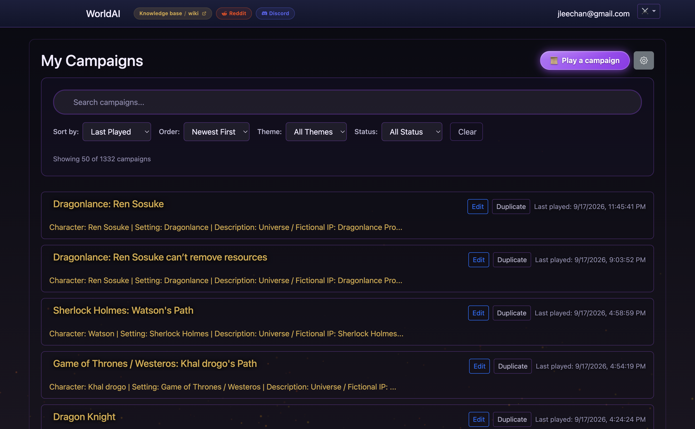
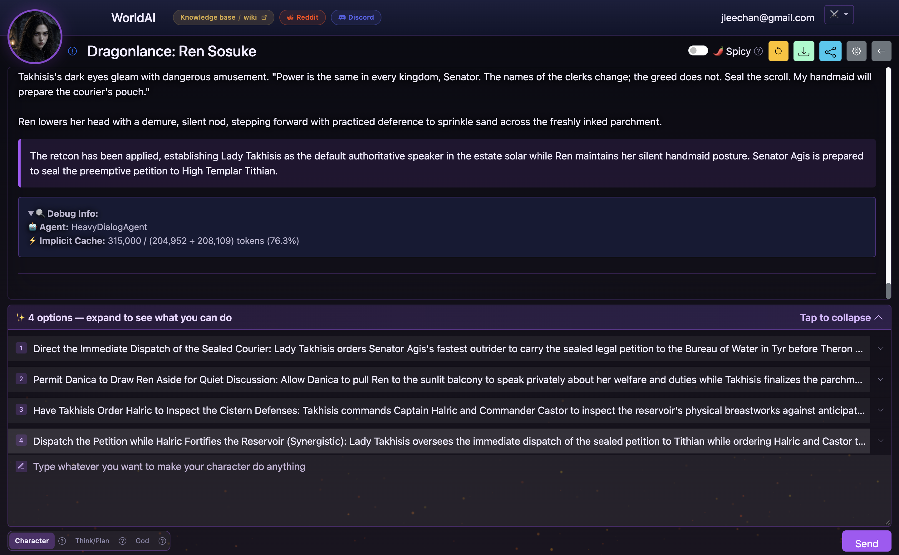

# WorldArchitect.AI Wiki

> The player-facing guide to [WorldArchitect.AI](https://worldarchitect.ai) — a structured D&D 5e game with server-side dice, persistent world state, faction play, and player-authored god-mode directives that shape narration.

## Quick start: What to do

WorldArchitect.AI runs tabletop-style D&D 5e RPGs in your browser with server-side dice, persistent state, and AI narration.

```
Dashboard  ──>  Step 1: Choose Type & Prompt  ──>  Step 2: Launch  ──>  Turn Loop (Character / Think / God)
```

1. **Open your dashboard**: Sign in at [worldarchitect.ai](https://worldarchitect.ai) to access your campaigns or start a new one.
2. **Configure in the 2-step Wizard**:
   - **Step 1 (Choose Type & Customize)**: Select your universe (Game of Thrones, Star Wars, Cyberpunk, Witcher, Dune, or custom), era, protagonist, setting, and plot "what-if" direction.
   - **Custom Campaign Description Prompt**: Expand section 7 (**Campaign description prompt**) to paste your own complete campaign bible, world lore, faction rules, or custom premise. The system handles large prompts (tested up to 70KB+ without client or server truncation), letting you bring extensive custom worlds directly into the browser.
   - **Step 2 (Ready to Launch)**: Upload an optional character portrait, review the editable summary card, and click **Enter the World**.
3. **Play turn by turn**:
   - The GM introduces the opening scene and confirms your character sheet.
   - Choose from 4 AI-suggested actions (with pros/cons) or write your own action.
   - Use the composer mode selector:
     - `Character`: Standard in-character roleplay actions and dialogue.
     - `Think/Plan`: Strategic reflection or OOC planning with the GM before committing.
     - `God`: Set persistent narrative style rules and tone directives (`GOD MODE: ...`).

---

### Visual walkthrough

#### 1. My Campaigns Dashboard
Manage active worlds, view level and turn progress, and jump directly into active sessions.



#### 2. Campaign Wizard — Step 1 & Custom Description Prompt
Configure your campaign universe and character. Expand Section 7 (**Campaign description prompt**) to paste long custom world bibles and premises.


#### 3. Campaign Wizard — Step 2 Ready to Launch
Drop in an avatar portrait, review or inline-edit your setup, and launch into the game.


#### 4. Active Gameplay & Action Composer
Read narrative logs, inspect roll results and stats, expand AI suggested actions, or write custom actions with Character, Think/Plan, or God mode.



---

### Quick summaries

#### How to play — first 30 minutes
Sign up at [worldarchitect.ai](https://worldarchitect.ai), open the Campaign Wizard, pick a preset (like Dragon Knight) or build your custom world, and click Launch. In Scene 1, confirm your build with the GM. The play loop runs: GM narrates → you act → server rolls dice if needed → GM narrates outcome. Adjust narration anytime using god-mode directives or plan moves with `THINK:` mode. See [how-to-play-worldai](queries/how-to-play-worldai.md).

#### How to design a campaign
Pick a **setting** (preset or custom), **power level** (bounded L1-5, escalating L1-20, or sandbox), and **tone** (stoic, dramatic, comedic, grimdark, or hopeful). Fill out the structured wizard fields and paste any deep world lore into the expanded **Campaign description prompt**. Plan an active opening scene and define 1-3 god-mode directives early. See [CampaignDesign](concepts/CampaignDesign.md).

#### How to prompt god mode
Directives are persistent rules stored in campaign state that act as a stylistic lens for all future narration. Effective directives state concrete traits, list specific taboos, and anchor character worldview (e.g., `X is/does Y. Avoid Z. Always W.`). Use `GOD MODE: <directive>` in the composer during play, or drop rules using `GOD MODE: drop <rule>`. See [GodModePrompting](concepts/GodModePrompting.md).

---

## Executive summary

WorldArchitect.AI is a tabletop-style RPG that runs in your browser. The system runs the rules (initiative, dice, HP, spells, faction combat); an AI narrates the world around your choices. You steer the story two ways: **in-character actions** (what your character does) and **god-mode directives** (persistent rules you set that shape how the narration sounds). Campaigns can last a few scenes or several hundred, escalate from a single village to multiverse-spanning stakes, and support solo play, party play, or running a faction.

This wiki is the player manual. It assumes you've signed up at [worldarchitect.ai](https://worldarchitect.ai) and want to know what to do next.

**What you'll find here:**

- **How to play** — your first 30 minutes, step by step.
- **How to design a campaign** — pick a setting, write a god-mode header, plan an arc.
- **How to prompt god mode** — write directives that actually change the prose.
- **75 player user stories** — every feature in "as a player, I want…" form.
- **75 external user stories (EXT-026–EXT-100)** — accounts, live UI, settings, MCP/API, agents, persistence, dice audit, export. See [ExternalUserStories](queries/ExternalUserStories.md).
- **System reference** — combat, dice, faction minigame, level-up, spells, character creation.
- **Case studies** — a handful of published campaigns illustrating what works.

The case studies are illustrative, not normative. The system supports any setting (built-in or custom), any tone (stoic to comedic), and any power level (bounded L1-5 to sandbox god-tier). The wiki's recommendations are patterns — pick the ones that fit your campaign.

---

## Table of contents

### Start here

| If you want to… | Read |
|---|---|
| Understand what the game is | [What is WorldArchitect.AI?](entities/WorldArchitect.md) |
| Play your first session | [How to play — first 30 minutes](queries/how-to-play-worldai.md) |
| Plan a campaign before launching | [How to design a campaign](concepts/CampaignDesign.md) |
| Shape how the narration sounds | [How to prompt god mode](concepts/GodModePrompting.md) |
| See every feature in one list | [75 player user stories](queries/PlayerUserStories.md) |
| Integrate with the game over API or MCP | [External user stories (EXT-026–EXT-100)](queries/ExternalUserStories.md) |

### Core systems (concepts/)

| System | What it covers |
|---|---|
| [Combat](concepts/Combat.md) | Initiative, turn order, action economy, AoE, conditions |
| [Dice](concepts/Dice.md) + [DiceAuthenticity](concepts/DiceAuthenticity.md) + [DiceNotation](concepts/DiceNotation.md) + [DiceRollMechanics](concepts/DiceRollMechanics.md) | Server-side rolls, `1d20+5` notation, anti-fabrication |
| [Spellcasting](concepts/Spellcasting.md) | Spell slots, preparation, concentration |
| [Healing](concepts/Healing.md) + [RestAndDeath](concepts/RestAndDeath.md) | HP recovery, short/long rest, death saves |
| [LootAndRewards](concepts/LootAndRewards.md) | Treasure, XP, items |
| [LevelUp](concepts/LevelUp.md) + [LevelUpProgression](concepts/LevelUpProgression.md) + [ASI](concepts/ASI.md) + [Subclass](concepts/Subclass.md) | Level-up modal, long-term progression, ability-score-improvement choices |
| [CharacterCreation](concepts/CharacterCreation.md) + [CharacterArchetype](concepts/CharacterArchetype.md) + [CharacterMode](concepts/CharacterMode.md) + [AbilityScores](concepts/AbilityScores.md) + [AdvantageDisadvantage](concepts/AdvantageDisadvantage.md) | Building a character: AI-gen vs hand-roll, classes, ability scores, advantage/disadvantage |
| [CompanionArc](concepts/CompanionArc.md) + [CompanionPersonality](concepts/CompanionPersonality.md) + [NPCRelationships](concepts/NPCRelationships.md) | Companions and NPC reputation |
| [FactionSystem](concepts/FactionSystem.md) + [FactionPlay](concepts/FactionPlay.md) + [FactionManagement](concepts/FactionManagement.md) + [FactionPower](concepts/FactionPower.md) + [FactionCampaigns](concepts/FactionCampaigns.md) | The faction minigame end-to-end |
| [LivingWorld](concepts/LivingWorld.md) | World state evolves between player actions |
| [GodMode](concepts/GodMode.md) + [GodModePrompting](concepts/GodModePrompting.md) | Player-supplied style rules that shape narration |
| [CampaignDesign](concepts/CampaignDesign.md) + [CampaignWizard](concepts/CampaignWizard.md) | Designing a campaign, the 2-step creation flow |
| [DnD5eRules](concepts/DnD5eRules.md) | The D&D 5th Edition rule spine |
| [Initiative](concepts/Initiative.md) + [CombatVictoryProtocol](concepts/CombatVictoryProtocol.md) + [SmartSkillChecks](concepts/SmartSkillChecks.md) | Combat resolution |

### Reference (entities/)

| Page | What it is |
|---|---|
| [WorldArchitect](entities/WorldArchitect.md) | The game itself — 5-minute pitch |
| [WorldAI](entities/WorldAI.md) / [WorldArchitectAI](entities/WorldArchitectAI.md) | Alias redirects |
| [CampaignShowcase](entities/CampaignShowcase.md) | Gallery of example campaigns (case studies) |
| [ItachiGaiden](entities/ItachiGaiden.md), [AristocratReborn](entities/AristocratReborn.md), [NocturneBg3](entities/NocturneBg3.md), [PrinceDaemon](entities/PrinceDaemon.md), [Daemon](entities/Daemon.md), [AegonTargaryen](entities/AegonTargaryen.md), [ItachiUchiha](entities/ItachiUchiha.md) | Individual published-campaign case studies |
| [FrierenCampaign](entities/FrierenCampaign.md), [LukeCampaign](entities/LukeCampaign.md), [SarielCampaign](entities/SarielCampaign.md), [SarielCrossCampaign](entities/SarielCrossCampaign.md) | Additional archetype examples |
| [ChiontharWyrm](entities/ChiontharWyrm.md) | Combat encounter example |
| [FactionMinigame](entities/FactionMinigame.md) + [FactionBattleSim](entities/FactionBattleSim.md) + [FactionIntel](entities/FactionIntel.md) + [FactionRankings](entities/FactionRankings.md) | Faction minigame subsystems |
| [GOD_MODE_RESPONSE](entities/GOD_MODE_RESPONSE.md) | God mode's response shape |
| [CampaignWizard](entities/CampaignWizard.md) | The creation-flow entity |

### Comparisons

- [vs AI Dungeon](comparisons/WorldArchitect-vs-AIDungeon.md) — structured D&D 5e GM vs freeform LLM storytelling
- [vs RPG Bots](comparisons/WorldArchitect-vs-RPG-Bots.md) — vs Discord RPG bots

### FAQ

- [Dice FAQ](queries/DiceFAQ.md) — common dice questions
- [GodMode FAQ](queries/GodModeFAQ.md) — common god-mode questions
- [Faction FAQ](queries/FactionFAQ.md) — common faction questions

### Meta

- [SCHEMA.md](SCHEMA.md) — wiki conventions, frontmatter, tag taxonomy
- [log.md](log.md) — change history
- [index.md](index.md) — full page catalog

---

## Recommended reading order

If this is your first time, read these four pages in order and skip the rest:

1. **[What is WorldArchitect.AI?](entities/WorldArchitect.md)** — what the game does and doesn't do.
2. **[How to play](queries/how-to-play-worldai.md)** — sign up, run the wizard, take your first action.
3. **[How to design a campaign](concepts/CampaignDesign.md)** — pick a setting, write a god-mode header, plan your arc.
4. **[How to prompt god mode](concepts/GodModePrompting.md)** — write directives that change how the narration sounds.

Once you've played one session, read [Player User Stories](queries/PlayerUserStories.md) to see what's possible, then browse [Campaign Showcase](entities/CampaignShowcase.md) for inspiration.

## Contributing

This is a public reference wiki. If you find errors or want to suggest additions, open an issue on this repo.

The private game code (`jleechanorg/worldarchitect.ai`) is the source of truth for behavior. This wiki summarizes and explains — it does not duplicate code paths.

## License

MIT. See [LICENSE](LICENSE).
