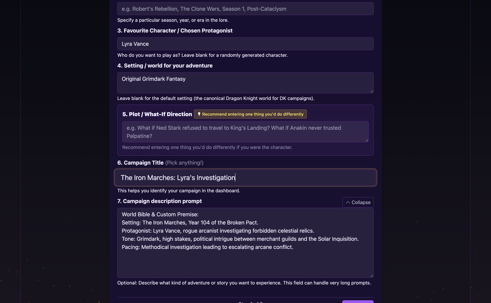
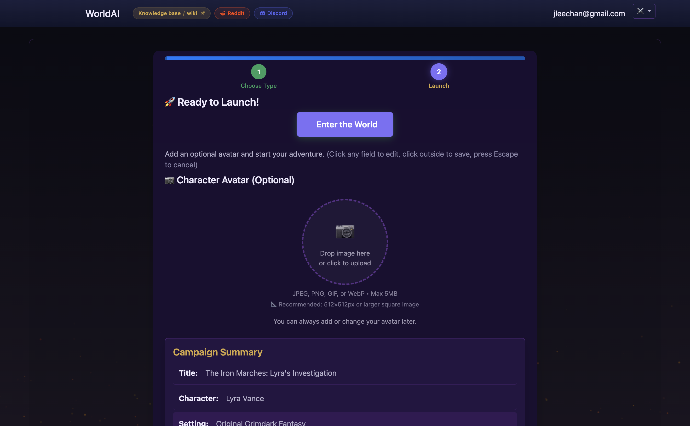

# Campaign Wizard

The Campaign Wizard is the 2-step creation flow for launching a new adventure in WorldArchitect.AI.

```
Step 1: Choose Type & Customize  ──>  Step 2: Ready to Launch!  ──>  Scene 1: Character Review & Opening
```

---

## Step 1 — Choose Type & Customize

Step 1 collects your world concept, protagonist, and campaign premise.



### 1. Campaign type

Select the starting foundation:
- **Play a campaign**: Create a completely custom world, universe, and story from scratch.
- **Pre-built modules** (e.g. *Dragon Knight Campaign*): Pre-configured lore, companion dynamics, and a calibrated opening scene.

### 2. Universe and setting inputs

- **Favorite Universe / TV Show / IP**: Quick-select preset pills (Game of Thrones, Star Wars, Cyberpunk, The Witcher, Middle-earth, Stranger Things, Marvel, Dune) or type any custom franchise or fictional realm.
- **Timeline / Era (Optional)**: Anchor your story in a specific period (e.g. *Robert's Rebellion*, *The Clone Wars*, *Post-Cataclysm*).
- **Chosen Protagonist / Character**: Enter your character's name and archetype, or leave blank for a randomly generated protagonist.
- **Setting / World**: Multiline description of the physical, political, and magical environment.
- **Plot / What-If Direction**: Define the central conflict or departure point (e.g. *"What if Ned Stark refused to become Hand of the King?"*).
- **Campaign Title**: Identifying title for your campaign card on the dashboard.

### 3. Campaign description prompt (Long-form world bible)

Section 7 features the **Campaign description prompt** accordion (`#wizard-toggle-description`). When expanded, it reveals a full-width multiline textarea designed for pasting large custom campaign bibles, premise descriptions, and system instructions.

- **Capacity & Estimated Word Count**:
  - **Text size**: Tested up to 70KB+ of prompt text without client-side truncation or backend payload clipping.
  - **Estimated word count**: ~11,500 to 14,000 words (median ~12,500 words, ~17,500 LLM tokens, or 25–28 single-spaced document pages / 45–55 paperback pages).
  - **Comparative scale**: Accommodates 4 to 5 times the volume of published campaign bibles like *Aristocrat Reborn* (~3,100 words) or *House of the Dragon* (~2,500 words) in a single paste.
- **What to paste here**:
  - Full setting bibles (geography, factions, pantheons, magic systems).
  - Character backstory, lineage, equipment notes, and psychological profile.
  - Custom rules, narrative tone constraints, and god-mode style instructions.
- **Short vs. Long**:
  - *Short prompts (1–3 sentences)*: Give the AI high creative freedom to flesh out details.
  - *Long bibles (5,000–14,000 words / 30,000–70,000+ characters)*: Enforce strict canon compliance, complex political states, or custom RPG system conventions.

Click **Next** to proceed to Step 2.

---

## Step 2 — Ready to Launch!

Step 2 handles visual customization, summary confirmation, and world initialization.



### 1. Character portrait avatar

- Drag-and-drop or click to upload a custom avatar image.
- Supported formats: JPEG, PNG, GIF, WebP (Max 5MB; 512×512px square recommended).
- The avatar appears in the top navigation bar and beside your dialogue during turns.

### 2. Campaign summary card & inline editing

Review your configuration before launching:
- Displays your Title, Universe, Character, Setting, and truncated Description Prompt.
- Includes inline editing buttons (**Edit title**, **Edit character**, **Edit setting**, **Edit description**) to adjust details instantly without navigating back to Step 1.

### 3. Enter the World

Click **Enter the World** (`#wizard-launch`). The server generates your persistent campaign state, initializes the rulebook engine, and opens Scene 1.

---

## After the wizard: Scene 1 Character Review

Unlike legacy 3-step wizards where character sheets were finalized in a detached form, WorldArchitect.AI integrates character creation directly into the opening narrative:

1. The GM introduces your character in the opening scene context.
2. The GM presents your generated character sheet (ability scores, class, starting spells, and equipment).
3. You review, request modifications, or finalize your build before your first major narrative decision.

---

## Player tips

- **Take advantage of the description prompt**: If you have a favorite homebrew world or novel concept, paste your notes directly into Section 7.
- **Avoid conflicting instructions**: Specify a coherent primary tone in your description prompt rather than mixing contradictory styles (e.g., pure slapstick comedic alongside grimdark survival).
- **Inline edits save time**: If you spot a typo in your setting or title on Step 2, use the inline edit buttons on the summary card instead of hitting back.

See [CharacterCreation](CharacterCreation.md), [CampaignDesign](CampaignDesign.md), [GodModePrompting](GodModePrompting.md), and [How to Play](../queries/how-to-play-worldai.md).
