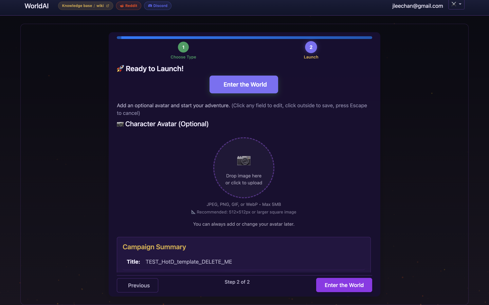

# House of the Dragon — Custom Campaign Template

A ready-to-play **House of the Dragon** solo campaign for [WorldArchitect.AI](https://worldarchitect.ai). You play a **gender-ambiguous bastard Targaryen** — child of Prince Daemon Targaryen and a dead Targaryen lady — who has just claimed a dragon on the eve of the Dance of the Dragons civil war.

> **You can pick your own gender, class, background, dragon name, parent swap (other Targaryen father/mother), look, starting relationship, and pretty much anything else.** The template's default is a 16-year-old dragonrider, but if you want to be a woman knight sworn to Rhaenyra, a male maester-in-training, a bastard of Aegon II instead of Daemon, a 30-year-old veteran, a non-Targaryen outsider, etc. — just write what you want in the **Character you want to play** field on Step 1 of the wizard. The AI Dungeon Master plays whatever you describe. See [Customize the character](#customize-the-character) below for full swap examples.

This page is split into two parts:

1. **[Quick Setup](#1-quick-setup)** — three minutes. Sign in, paste, play.
2. **[More Details](#2-more-details)** — character customization, LLM editing, mechanics deep-dive, troubleshooting, screenshots.

If you want the paste-ready bible and step-by-step launch, jump to **Quick Setup**. If you want to customize the character, understand the mechanics, or troubleshoot, scroll to **More Details**.

---

## 1. Quick Setup

**What you're playing** — a 16-year-old dragonrider, officially a bastard, who just claimed a dragon on a black volcanic beach. Grimdark political intrigue. Power fantasy on dragonback. [Dance of the Dragons](https://awoiaf.westeros.org/index.php/Years_after_the_Conquest#Year_129_AC), ~129-131 AC.

**Three minutes to launch:**

1. **Sign in** at [worldarchitect.ai](https://worldarchitect.ai) with Google.
2. **Click "Start New Campaign"** on the dashboard. Pick **Custom Campaign** (the default).
3. **Fill the form:**

| Field | Paste this |
|---|---|
| **Campaign Title** | `House of the Dragon — The Bastard's Claim` |
| **Character you want to play** | `A 16-year-old dragonrider, gender-ambiguous bastard of Prince Daemon Targaryen, just claimed a young adult she-dragon` *(or write your own — see examples below)* |
| **Setting/world** | `The Dance of the Dragons, 129-131 AC. Westeros on the eve of the Targaryen civil war. Dragonstone, King's Landing, the Riverlands.` |
| **Campaign description prompt** *(click ▶ Expand)* | **The entire bible below — copy everything between `BEGIN_COPY_PASTE_BIBLE` and `END_COPY_PASTE_BIBLE`** |
| **Use Default Fantasy World (Celestial Wars/Assiah setting)** | **UNCHECK THIS** (it's checked by default — the template is ASOIAF/HotD, not the built-in setting) |

**:pencil2: Make the character yours (optional but recommended).** The default Character text above is one valid setup, but the AI Dungeon Master plays *whatever* you write in this field. Pick whatever you want — the bible (further down) is a flexible skeleton that adapts. Examples:

- **Pick a gender** — `A 16-year-old she-dragon rider, gender-explicit bastard of Prince Daemon Targaryen, just claimed a young adult she-dragon` or `…they, the elder bastard of…`
- **Pick an age** — `A 22-year-old dragonrider, just returned from exile, bastard of Prince Daemon Targaryen`
- **Pick a class** — the bible defines a Dragonrider Aristocrat; you can override to `a bastard maester who secretly bonded a dragon`, `a dragonseed smallfolk with no noble blood`, or `a hedge knight sworn to House Velaryon who impressed a dragon in battle`
- **Name the dragon** — add `riding the dragon Vyraxes` to the character line, or `who named their dragon Saeris`
- **Swap the parent** — `bastard of Prince Aemond (the one-eyed rider of Vhagar) and a Lysene pleasure-worker`, or `bastard of Lord Corlys Velaryon and a Targaryen handmaid`
- **Different look** — `pale silver-blonde with a missing eye and burn scars across the left arm`, `copper-skinned and lean, dressed in House Velaryon sea-leather`
- **Different starting relationship** — `secretly a Green spy pretending to be Black`, `in love with Baela Targaryen`, `hiding the dragon from the entire court`

If you write your own Character text, the bible below still applies — the dragon-bond, Blood-of-the-Dragon compulsion, family tree, factions, and starting scene all adapt to whichever protagonist you describe. If you leave the field blank, the AI auto-generates a random character and you lose the dragon-claim opening.

4. **Click Next → "Enter the World".** The AI Dungeon Master will narrate the **claiming scene** from Section 9 of the bible: black volcanic sand, your dragon screaming, the dragonkeepers fleeing, a window opening in the Sea Tower. You'll then be offered an **A/B/C first decision** (fly to the Sea Tower / touch the dragon's snout first / speak High Valyrian) — pick any of the three and the story begins. Type freely after that; the bible is your context, not a script.

If anything looks wrong, see [Troubleshooting](#troubleshooting).

### Copy-Paste Bible

**Copy everything below this line:**

```text
BEGIN_COPY_PASTE_BIBLE — copy everything between BEGIN and END
═══════════════════════════════════════════════════════════════════════════

# Campaign Bible: House of the Dragon — The Bastard's Claim

## 1. Campaign Intro

You are a bastard of Prince Daemon Targaryen, by a Targaryen lady whose name the court has been told to forget. Both your parents are dragonlord blood — your mother from a cadet branch of Old Valyria, your father from the Conqueror's line. You have no seat, no inheritance, no name anyone is obliged to remember.

What you have is the one thing the highborn fear: a dragon who chose you.

This morning, on a black volcanic beach the maesters will not write about, a young adult she-dragon screamed your name. You walked into the smoke. You came out mounted. The greens will call it usurpation. The blacks will call it providence. The smallfolk will call it terrifying.

Hook: You are not saving the realm. You are claiming your place in it — on dragonback, in fire, before anyone can stop you.

Era: The Dance of the Dragons (~129-131 AC). Rhaenyra's Blacks hold Dragonstone; Aegon II's Greens hold King's Landing. The realm has no king everyone accepts.

## 2. Character Personality

Core archetype: "The Apparent Right." You look, walk, and speak like the trueborn heir everyone wishes you were. Silver hair, lilac or violet eyes, sharp cheekbones, copper skin — your face itself broadcasts the royal blood your birth status denies you.

Public face: Quiet, courtly, deferential where it costs nothing.
True nature: An apex predator who has decided that legitimacy is a story the powerful tell the powerless, and that you are now powerful enough to write your own story.

Gender: AMBIGUOUS — the character may be he/him, she/her, or they/them. Pronouns, body type, hairstyle, and personal style are player-chosen variables. The character is 16 years old.

Voice: Low and unhurried. Speaks Old Valyrian when angry; the highborn freeze because they forgot you knew it.
Habit: Tilts head 5° when listening — like a dragon deciding if prey is worth the breath.
Smell: Woodsmoke and salt. You refuse perfumes that hide where you came from.

Core Compulsion Mechanic (Blood of the Dragon): Each time you visibly prove royal blood in front of a hostile witness, gain a bonus action on the next turn. Overuse (3+ times per session): roll a DC 12 Wisdom save or take 1 level of Exhaustion. (The 1st–2nd activation is safe — risk only kicks in if you lean on royal-blood displays more than twice in a single session.)

Three inner-monologue seeds:
1. "They call me 'bastard' as if the word still has teeth. Let them. The dragon doesn't care what they call me. The dragon only knows my name."
2. "Mother died so I could live. Every breath I take is borrowed. The least I can do is make it expensive for the people who let her die."
3. "Rhaenyra is a queen. Aegon is a king. I am the one on a dragon. The realm will learn which title matters more."

## 3. Character Class — Dragonrider Aristocrat (Lvl 6 base)

A custom gestalt: Fighter HP (half standard) + Rogue Sneak Attack progression (1d6 → 3d6 by L6) + Medium Armor + Shield. Charisma 16+ primary, Dexterity 14+ secondary. Saves: Dex, Cha. Skills: Persuasion, Insight, Intimidation, History, Survival, Animal Handling.

Signature ability — DragonsBond (once per long rest):
- Summon your dragon as a free action. The dragon is a bonded NPC ally with its own stat block (Adult Dragon, CR 13, ~195 HP at L6).
- Shared senses: see through the dragon's eyes as a bonus action.
- Telepathic voice within 10 miles per character level.
- Mounted combat: advantage on Dex (Acrobatics) to stay mounted. While mounted, your dragon's attacks count as yours for triggering Sneak Attack if your dragon is within 5 ft of your target.

Pick a name for your dragon. Examples: Vyraxes, Carmine, Maelghar, Aethon, Saeris. (Gender-ambiguous dragon naming welcome.)

## 4. Assets & Retinue

Starting rank: "Acknowledged bastard of Prince Daemon, no land, no seat, no household knights."

Wealth: 30 gold dragons.

Starting gear (The Panoply):
1. Mother's ring — a Valyrian steel band set with a ruby, cold to the touch. Worthless to anyone who doesn't know what it is.
2. A black cloak lined with crimson silk — once Daemon's. You are 16 and wearing your father's clothes on purpose.
3. A dagger of Valyrian steel — unaccounted for in the dragonmont's armory. Officially yours.
4. A book of Valyrian names — your mother's, the only book that survived.

Starting companions (3 NPCs):
1. Ser Ulwyck "the Debtor" — Fighter 5, age 40, ex-City Watch. Loyal because he owes your father a blood-debt. Bitter, competent, dry-witted.
2. Alys "the Steward" — age 14, a bastard-born girl from Lys. Sharp as a new knife. Runs your tower room. Quiet, observant, never speaks first.
3. Maester Lyman "the Apologist" — elderly maester who was on Driftmark when your mother died. Told you the truth about it when you were 8. Remorseful, pedantic, kind in a way that hurts.

## 5. Family (The Viper's Nest)

Prince Daemon Targaryen (father): Hegemon of the Crownlands. Lvl 20+ Fighter/Champion. Rides Caraxes. Has not acknowledged you in writing. Has not denied you. Sent you the black cloak without comment. You are a test he is running. He could legitimize you and break you, or refuse and let the greens destroy you. He enjoys both possibilities.

Lady Rhaenys Targaryen, née Velaryon ("The Queen Who Never Was"): Your mother's older cousin. Lvl 14 Paladin. Rides Meleys. She sees you. She will not protect you, but she will not deny you.

Four older siblings:
1. Rhaenyra Targaryen ("The Queen") — half-sister (Daemon's daughter by his first wife). The claimant to the throne. Useful.
2. Aegon II Targaryen ("The Usurper") — half-brother. Greens' king. Will kill you if he sees you.
3. Baela Targaryen ("The Drake's Daughter") — half-sister (Daemon's daughter by Laena Velaryon). Both dragonriders. Rival / possible ally.
4. Jacaerys Targaryen ("The Heir") — Rhaenyra's eldest son; your nephew by blood. Possible future king. Pawn he doesn't know he's playing.

## 6. Factions

Use these as political chess and tools:

Noble Houses: Hightower (Faith/Fleet, the High Septon is a plant), Velaryon (Naval, Corlys's debts are leverage), Lannister (Gold, sellswords), Stark (Honor, Cregan enforces King's Peace), Arryn (Knights of the Vale, Jeyne needs an aerial scout), Tully (Riverlands, rivermoots), Baratheon (Stormlands, Boremund backs whoever rides into Storm's End on a dragon first), Tyrell (Reach, marriage trades), Targaryen (your blood, your family), Blackwood-vs-Bracken (Riverlands feud, dragon-fire makes one-trip examples).

Friendly factions (tools): The Dragonkeepers of Dragonstone, the Silent Sisters, the Citadel (dragonscale buyers), the Faith Militant (Militant Uprising era — Poor Fellows follow anyone who feeds them), the Stormlands Marcher Lords, the Free Cities mercenaries (scare them first), the Iron Bank of Braavos (they only care about ledgers), the Whispers of Lys (your mother's network, still active), the Drowned Men of the Iron Islands (they back ships, not gold), the Street of Silk courtesans of King's Landing (information flows, your dragon can land anywhere in the city).

Antagonistic factions (structural threats): The Hightower Faith Militant (militant fanatics), the City Watch of King's Landing (gold-cloaks, Hightower-paid), the Kingsguard (sworn to the usurper), the Velaryon Fleet (anti-Rhaenyra faction), the Hightower-Controlled Maesters (will falsify your lineage in the records), the Black Cells of the Red Keep (no rescue if captured), the Braavosi assassin cell "The Titan's Daughter" (sells contracts), the Volantene Triarchs (anti-dragon coalition), the Stormlands peasant levies (anti-dragon terror, shoot from rooftops), the Faith Militant's Poor Fellows (anti-noble religious terrorism).

## 7. World Lore

Timeline (key dates):
- ~113 AC: Your mother brought to King's Landing. Daemon notices her.
- ~115 AC: Your mother dies in childbirth complications at Driftmark. You survive.
- 129 AC: King Viserys dies. The Dance begins.
- ~130 AC (NOW): You claim your dragon. You declare for Rhaenyra.
- 131 AC: Battle Above the Gods Eye. Daemon and Caraxes die.
- ~131-133 AC: Rhaenyra takes King's Landing, then is captured and fed to a dragon.
- ~133 AC: Aegon II poisoned. The Dance ends.

Dragon Bond (magic system):
- Dragons are not mounts. They are bonded souls.
- A dragon chooses its rider. The claiming is mutual.
- A rider who loses their dragon loses a piece of themselves. They go hollow-eyed within a season.
- Bond range: ~100 miles at first claim, extending to "anywhere on the same continent" by adulthood.
- Dragon eggs hatch only in extreme heat (volcanic vents, dragonpits, pyromancer fires).
- Wild dragons exist in the Doom of Valyria ruins and volcanic Slaver's Bay. They are not bonded. They are not friendly.

Current dragon-counts:
- Blacks: Syrax (Rhaenyra), Caraxes (Daemon), Meleys (Rhaenys), Vermax (Jacaerys), Arrax (Lucerys), Tyraxes (Joffrey), Moondancer (Baela), Stormcloud (Aegon the Younger), YOUR DRAGON.
- Greens: Vhagar (Aemond, largest), Sunfyre (Aegon II), Tessarion (Daeron), Dreamfyre (Helaena).

Three arcs:
1. Early — The Proving. First dragon battle. Earn your place among the blacks.
2. Mid — The Court. Infiltrate King's Landing. Blackmail, seduction, arson.
3. Late — The Endgame. After Vhagar kills your father's dragon at the Gods Eye, you take Caraxes's rider's role.

## 8. Gazetteer & Mechanics

Stage 1 — Dragonstone (Black HQ): Black volcanic rock, sea wind, dragon smell.
- The Dragonmont — the volcano. Your dragon nests here.
- The Sea Tower — Rhaenyra's seat when Daemon is at Harrenhal.
- The Cellars of the Keep — pre-Targaryen Valyrian stonework. Rumored passage to the Dragonmont.
- Hazard: other dragonriders' dragons are territorial.

Stage 2 — King's Landing (Green HQ): Smell of humanity, gold cloaks, Faith Militant.
- The Dragonpit — under Aegon II's control. Your dragon cannot land here.
- The Street of Silk — your best ally in the green capital.
- The Red Keep — Aegon II's throne. To enter is to die.
- Hazard: Hightower-controlled City Watch will execute any known bastard of Daemon on sight.

Stage 3 — Harrenhal (Riverlands): Dragonfire-charred ruins. The largest castle in Westeros, melted by dragonflame.
- The Hall of a Hundred Hearths — Daemon's river council. Every lord who pledges here becomes a target.
- The Gods Eye — the lake below. Where dragons will die.
- Hazard: Vhagar patrols this area. Aemond will try to kill any dragon that crosses his shadow.

Stage 4 — Old Valyria (the Doom): Sulfur, ash, ghosts. Off-limits to men.
- The Fourteen Flames — volcanoes that never stopped burning.
- The Sorcerers' District — pre-Doom artifacts.
- Hazard: The Doom never ended. It just slowed down. Don't go there.

Custom Mechanic 1 — Blood of the Dragon Compulsion (see Section 2): each royal-blood proof grants a bonus action; 3+ uses per session = DC 12 Wis save or Exhaustion.

Custom Mechanic 2 — Dragon Rider's Hoard: your dragon collects objects of significance to you. After each major story beat, a small item appears at the dragon's nest. NPCs who receive a dragon-gift are 50% more likely to honor contracts signed in that moment.

Loot table — 8 dragon-relics (narrative power, no +1 swords):
1. The Queen's Tears (amethyst) — -1 Persuasion DC with female rulers, one scene.
2. The Old Tongue (black candle burning blue) — speak one sentence in High Valyrian an NPC obeys for one scene.
3. The Conqueror's Belt (leather baldric) — +1d6 damage on first melee attack after a political entrance.
4. A Bone from the Doom (melted femur) — auto-success on History checks about pre-Conquest Valyria.
5. A Child's Drawing (from Aegon III) — +2 Persuasion with anyone under 18.
6. A Tear of Meleys (red gem, warm) — once per long rest, your dragon ignores fire damage on one breath.
7. The Hightower's Spyglass (brass tube) — +5 Perception to spot a watcher.
8. A Hatched-But-Unhatched Egg (dormant) — held in reserve; at Level 21+ becomes a real dragon you can gift or bond.

## 9. Starting Scene

Atmosphere: Black volcanic sand. Salt air. The horizon a thin line of grey. Behind you, the smoke column from the Dragonmont rises straight into a sky with no wind.

Immediate hook: Your dragon — [name your dragon] — is screaming. Not the hunting scream, not the war scream. The claiming scream, the one that only fires once in a dragon's life when it accepts a rider. It is the scream that has not been heard on Dragonstone in twenty years.

The dragonkeepers are running. The maester is making the sign of the seven. From the Sea Tower, you can see a window open — someone is watching. It might be Rhaenyra. It might be one of her sons. It might be a crossbowman.

The dragon stops screaming. It looks at you. It is the size of a small inn. It is older than you. It knows you.

A/B/C first decision:

A) Mount and fly to the Sea Tower — make your claim public. Land on the balcony. Tell Rhaenyra what she has just received.

B) Touch the dragon's snout first, mount second — establish the bond silently, in private, before anyone with political weight knows. Walk into the keep as a bastard who is also a dragonrider, and let them wonder how.

C) Speak to it in High Valyrian — your mother's voice. The dragon will know. Everyone watching will know you are not a typical bastard.

The campaign begins on your answer.

═══════════════════════════════════════════════════════════════════════════
END_COPY_PASTE_BIBLE — stop copying here
```text

**Stop copying here.** Paste that into the "Campaign description prompt" field, click **Next**, then **Enter the World**.

---

## 2. More Details

### Customize the character

The "Character you want to play" field is yours. The default text is `A 16-year-old dragonrider, gender-ambiguous bastard of Prince Daemon Targaryen, just claimed a medium-sized she-dragon` — but you can change anything:

- **Explicit gender** — `A 16-year-old she-dragon rider, bastard of…` or `…they, the elder bastard of…`. The bible treats gender as a player-shaped variable, so set it however you want.
- **Different age** — older/younger, married, widowed, etc. The bible's "16-year-old" is just the default.
- **Name the dragon** — add `riding the dragon Vyraxes` to the character line, or `who named their dragon Saeris`.
- **Different parent** — swap Daemon for Prince Aemond (your mother's older cousin, the one-eyed rider of Vhagar), or for a non-Targaryen (a Velaryon bastard, a Blackwood lord's get), or write a fully original parent.
- **Different look** — copper skin vs. pale, silver-blonde vs. platinum, a scar from a prior dragon-claim attempt, a missing hand, etc.
- **Different starting relationship** — already sworn to Rhaenyra, secretly a Green spy, hiding your dragon from everyone, in love with one of the half-siblings, etc.

The AI Dungeon Master plays whatever you describe. If you leave the field blank, the AI auto-generates a random character and you lose the dragon-claim opening — **don't leave it blank** for this template.

### Editing the bible with an LLM (before you paste)

If you want bigger changes — a new era, a different parent, a new magic system, a new arc — paste the bible into your favorite AI chat and use this prompt:

> You are an expert narrative designer and Game Master. I have pasted the "House of the Dragon — The Bastard's Claim" custom-campaign template for WorldArchitect.AI. I want to edit it as follows:
>
> **[describe your changes here, e.g.,]**
> - Change the dragon's name from "[name your dragon]" to "Vyraxes"
> - Make the protagonist explicitly female, 18, not 16
> - Swap Daemon for Prince Aemond as the parent
> - Start the campaign two years earlier, before the Dance begins
> - Replace Vhagar's name with Balerion (ancient timeline)
>
> Apply only the changes I asked for. Preserve every other section verbatim. Return the full edited campaign bible, ready to paste into the WorldArchitect.AI "Campaign description prompt" field.

The 9-section structure is robust to most player-shaped edits. The wizard accepts the full bible (~13,350 characters / ~2,200 words) without truncation.

### Full setup walkthrough (every form field, every checkbox)

This is the detailed reference for what every field on the wizard does. The Quick Setup above covers the minimum; this is the annotated version.

**Step 1 — Sign in.** Go to [worldarchitect.ai](https://worldarchitect.ai). Click **Continue with Google** (or **Sign in with Google**) in the center of the page. The dashboard loads with your existing campaigns.

**Step 2 — Open the New Campaign wizard.** On the dashboard, click **Start New Campaign** (top-left, under "My Campaigns"). The wizard opens with a two-step indicator: **1 Choose Type → 2 Launch**.

**Step 3 — Pick "Custom Campaign".** Already selected by default. Leave it. The alternative is "Dragon Knight Campaign", a built-in starter adventure.

**Step 4 — Fill the Step 1 form.** Same table as Quick Setup, but with notes:

| Field | What to type | Notes |
|---|---|---|
| **Campaign Title** | `House of the Dragon — The Bastard's Claim` | Anything works; this is just your dashboard label. |
| **Character you want to play** | `A 16-year-old dragonrider, gender-ambiguous bastard of Prince Daemon Targaryen, just claimed a young adult she-dragon` | **This is the field you customize to make the character yours.** See [Customize the character](#customize-the-character). Don't leave blank. |
| **Setting/world for your adventure** | `The Dance of the Dragons, 129-131 AC. Westeros on the eve of the Targaryen civil war. Dragonstone, King's Landing, the Riverlands.` | Sets the campaign's setting anchor. |
| **Campaign description prompt** *(collapsed by default — click ▶ Expand)* | **Paste the entire bible above.** | The textarea accepts the full ~13,500-character bible without truncation (verified live). |
| **Narrative (Jeff's Narrative Flair)** | **Already CHECKED** by default. Leave checked. | Recommended for tone. |
| **Mechanics (Jeff's Mechanical Precision)** | **Already CHECKED** by default. Leave checked. | This template uses custom 5e mechanics (Blood of the Dragon compulsion, DragonsBond ability), so the AI Dungeon Master needs the mechanical-precision prompt enabled — and the wizard ships it on by default. No action needed. |
| **Generate starting Companions** | **Already CHECKED** by default. **OPTIONAL: uncheck this** if you want a tighter cast (the bible already lists 3 companions — Ser Ulwyck, Alys, Maester Lyman). | The bible's 3 starting companions are written into the description, so leaving this on just adds AI-generated extras alongside them. |
| **Use Default Fantasy World (Celestial Wars/Assiah setting)** | **CHECKED by default — UNCHECK THIS.** | This template is ASOIAF/HotD, not the built-in Celestial Wars setting. Unchecking it tells the AI to use the Westeros setting from your description field instead. |

**Step 5 — Click Next, review Step 2, launch.** Step 2 is the "🚀 Ready to Launch!" review screen. It shows the campaign summary and lets you click any field to edit it inline (click outside to save, press Escape to cancel):

- **Title**, **Character**, **Description** (your pasted bible — truncated in display but full text stored), **AI Personalities**, **Options**
- Optional character avatar upload (JPEG/PNG/GIF/WebP, max 5MB, recommended 512×512px or larger square)

If everything looks right, click **Enter the World**. The campaign begins with the bible's **Starting Scene** (Section 9 of the bible).



### What to expect on your first session

- The AI Dungeon Master will narrate the **claiming scene** — your dragon screaming on the volcanic beach, the dragonkeepers fleeing, Rhaenyra's tower window opening.
- You'll be offered the **A/B/C decision** from Section 9. Pick any of the three; the AI will follow.
- Combat starts when you decide to engage. The dragon combat system follows 5e rules (attack rolls, breath weapons, Dex saves). The **DragonsBond** ability gives you a bonded dragon ally with its own turn.
- **The campaign bible is your context, not a script.** If you want to do something the bible doesn't anticipate, just type it. The AI will roll with it.

### Class & mechanics deep-dive

**Dragonrider Aristocrat, Level 6 base.** Custom gestalt class:
- Hit points: as Fighter (half standard progression)
- Sneak Attack: as Rogue (1d6 → 3d6 at L6)
- Proficiencies: Medium Armor, Shield
- Primary stat: Charisma 16+ (Persuasion, Intimidation, dragon-bond roll)
- Secondary stat: Dexterity 14+ (AC, initiative)
- Saves: Dexterity, Charisma
- Skills: Persuasion, Insight, Intimidation, History, Survival, Animal Handling

**DragonsBond (signature ability, once per long rest):**
- Free action: summon your dragon as a bonded NPC ally
- Dragon stat block: Adult Dragon, CR 13, ~195 HP at L6
- Bonus action: see through the dragon's eyes
- Telepathic voice: 10 miles per character level
- Mounted combat: advantage on Dex (Acrobatics) to stay mounted
- Sneak Attack trigger: while mounted, your dragon's attacks count as yours for triggering Sneak Attack if your dragon is within 5 ft of your target

**Blood of the Dragon (compulsion mechanic, once per session):**
- Trigger: visibly prove royal blood in front of a hostile witness
- Effect: gain a bonus action on the next turn
- Limit: overuse (3+ times per session) requires DC 12 Wisdom save or take 1 level of Exhaustion

**Dragon Rider's Hoard:** your dragon collects objects of significance to you. After each major story beat, a small item appears at the dragon's nest. NPCs who receive a dragon-gift are 50% more likely to honor contracts signed in that moment.

See the in-tree developer doc ([`/Users/jleechan/projects/worldarchitect.ai/wiki/campaigns/HouseOfTheDragon.md`](https://github.com/jleechanorg/worldarchitect.ai/blob/main/wiki/campaigns/HouseOfTheDragon.md)) for the full source material.

### Troubleshooting

| Problem | Fix |
|---|---|
| "Campaign description prompt" looks empty after pasting | Click the **Expand** toggle above the textbox. The field is collapsed by default. |
| The AI uses World of Assiah lore instead of ASOIAF | Make sure **Use Default Fantasy World** is unchecked in Step 1. |
| The AI doesn't recognize your dragon | Confirm your dragon's name is in the description field. The AI treats the pasted bible as campaign lore. |
| You wanted a different gender expression | Use the [Customize the character](#customize-the-character) workflow to set explicit pronouns before pasting. The default is intentionally ambiguous. |
| The AI doesn't start at the dragon-claim scene | Open with: `I am on a black volcanic beach. My dragon is screaming. Tell me what I see.` — the bible will kick in. |
| Field labels in this guide don't match the live site | The live site updates labels occasionally. Field labels shown are correct as of Aug 2026. If the live site has changed, screenshot the wizard and check the [project wiki](https://github.com/jleechanorg/worldarchitect.ai) for the latest. |

### Related

- [How to play — first 30 minutes](../queries/how-to-play-worldai.md) — sign up, run the wizard, take your first action
- [CampaignDesign](../concepts/CampaignDesign.md) — setting, tone, arc shape, god-mode header writing
- [CharacterCreation](../concepts/CharacterCreation.md) — how custom classes are wired into the system
- [CampaignWizard](../concepts/CampaignWizard.md) — the wizard internals (Custom vs. Dragon Knight, prompt-pack flags)
- [Combat](../concepts/Combat.md) — the combat system overview

### Provenance

- User-requested wiki page: Slack C0AUXSVFSA2 thread ts=1785909171.805539, 2026-08-04
- Live-site verification: WorldArchitect.AI "Custom Campaign" wizard — Step 1 form fields, Step 2 review, and 15,000-character description-input acceptance probe (Aug 2026)
- Source material: synthesized from the existing [LLM wiki Visenya campaign line](https://github.com/jleechanorg/worldarchitect.ai) sources — `visenya-v7-daemons-bastard` (bastard framing), `campaign-template-prompt-v3` (9-section structure), `visenya-v8-gazetteer-mechanics` (gazetteer style), `visenya-v9-apex-stalker` (L6 class lever)
- Restructured into Quick Setup + More Details per user feedback (2026-08-05)