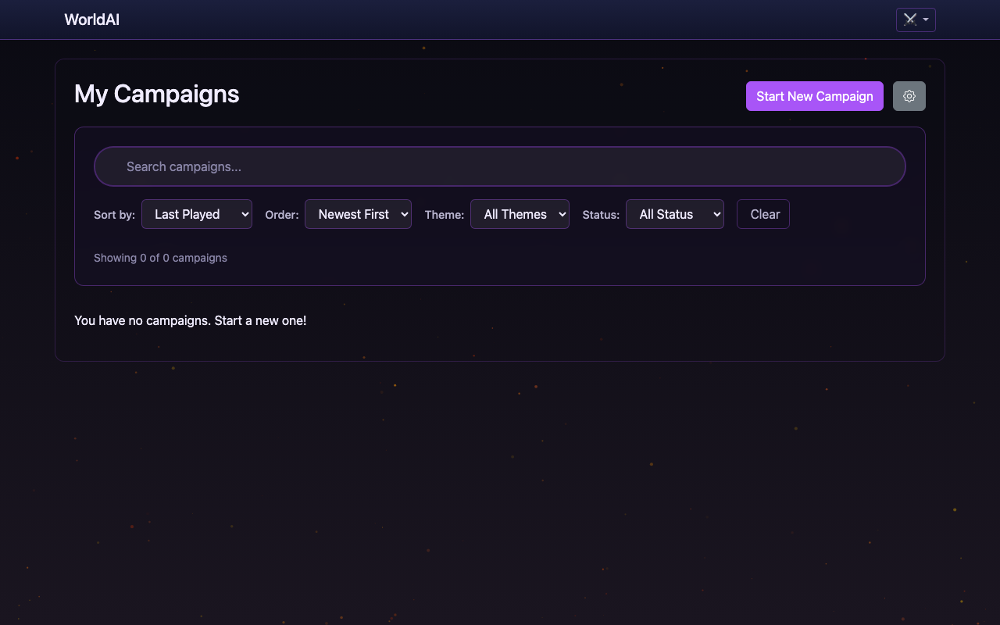
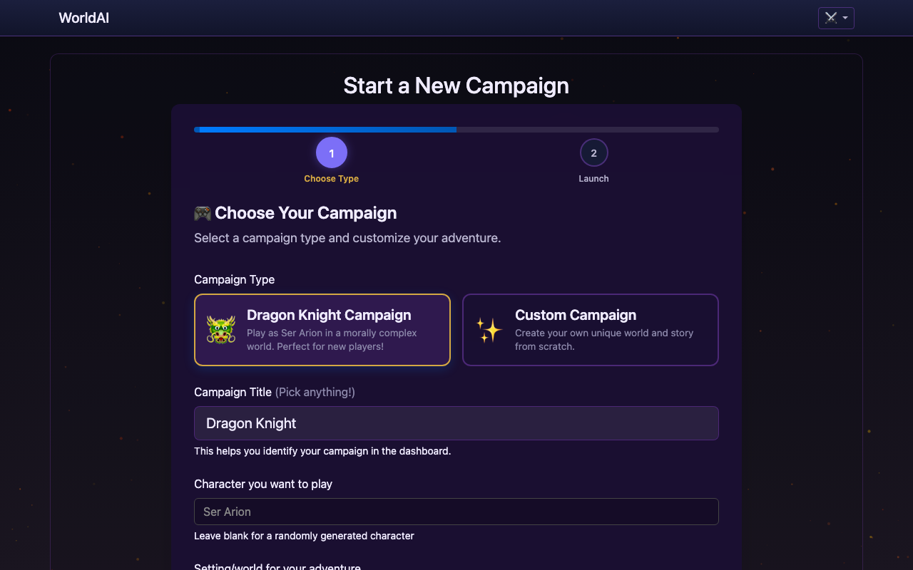
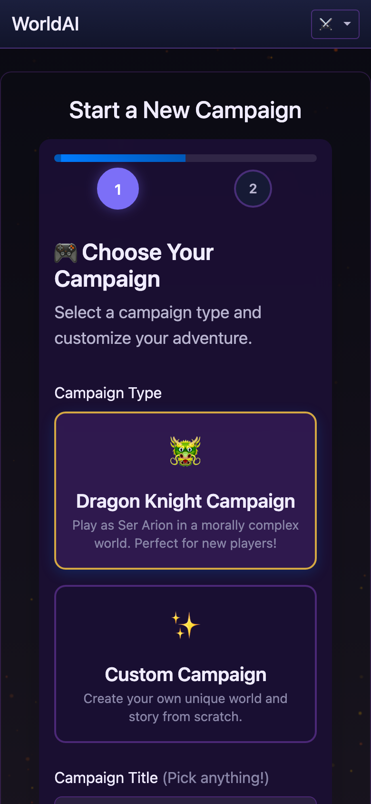
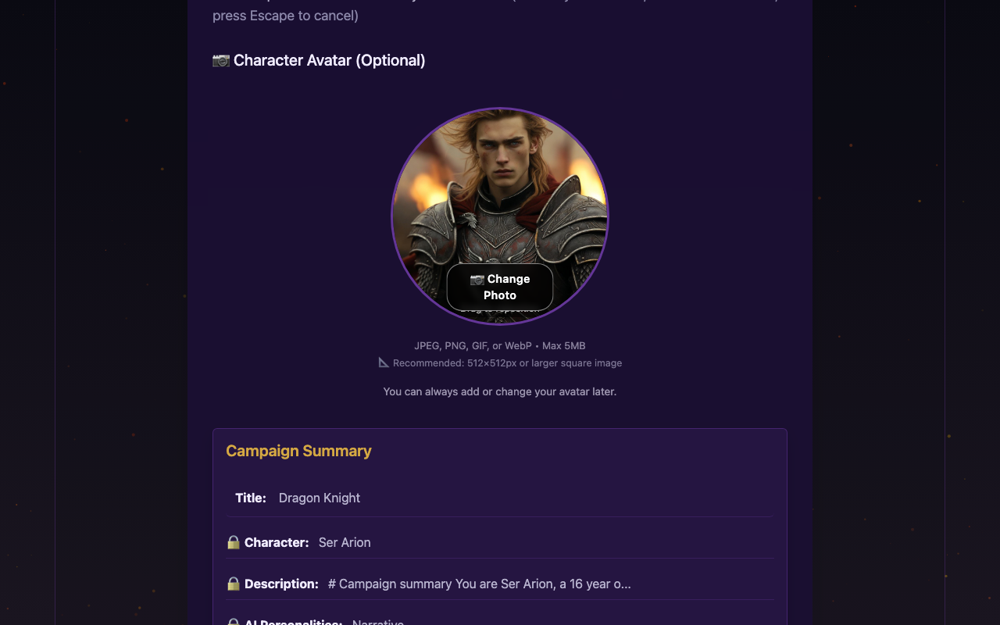
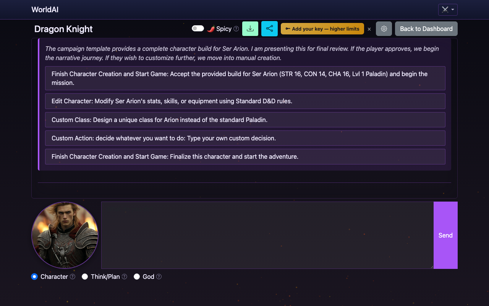
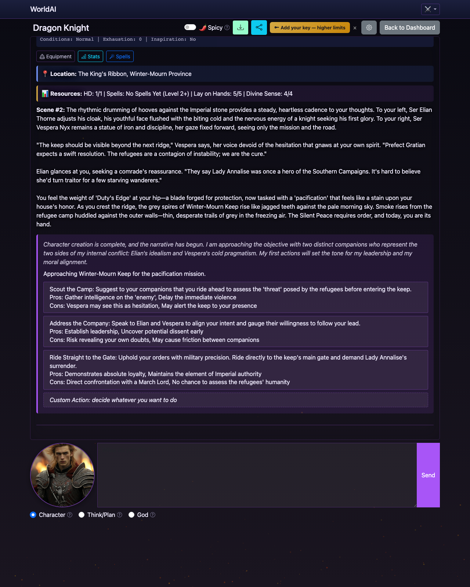
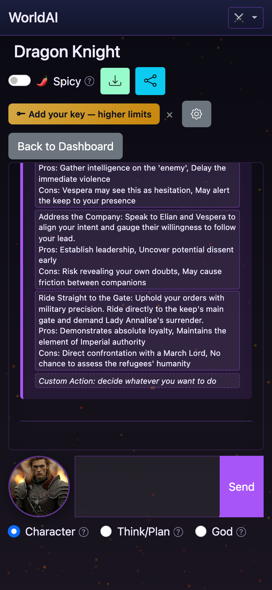
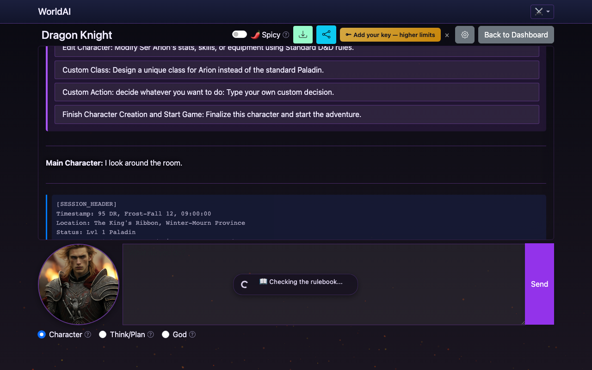

# How to Play WorldArchitect.AI

Your first 30 minutes with the game, step by step.

All screenshots below are **real captures** taken from a live [worldarchitect.ai](https://worldarchitect.ai) instance running the canonical **Dragon Knight** built-in campaign. Desktop shots are 1280×800; mobile shots are 390×844 (iPhone 12/13/14/15 standard).

## Before you start

You'll need:
- A web browser
- An account at [worldarchitect.ai](https://worldarchitect.ai)
- An idea for a setting (or willingness to use a built-in)

## Step 1 — Sign up

1. Go to [worldarchitect.ai](https://worldarchitect.ai).
2. Click "Sign in" (Google or Apple SSO).
3. Confirm your account.

After sign-in you'll land on your **My Campaigns** dashboard. From here, every session begins — this is the home base where you launch new campaigns, search your history, and pick up where you left off.

## Step 2 — Open the Campaign Wizard

From the dashboard, click "Start New Campaign". You'll see the [CampaignWizard](../concepts/CampaignWizard.md) — two steps. Step 1 is **Choose Type** (the setting/character pair). Step 2 is **Launch**.

**Same flow on mobile** (390×844, iPhone):

## Step 3 — Pick a setting

Either pick a built-in (**Dragon Knight**, Naruto, Game of Thrones, BG3, etc.) or describe your own. The example screenshots use the **Dragon Knight** built-in because it's the canonical campaign and produces the best-tuned opening scene for first-timers.

After you make your pick and click **Next**, the wizard moves to **Step 2 — Launch**, where you confirm and click "Enter the World" to start the campaign.

**Recommendation for first-timers**: pick the **Dragon Knight Campaign** card. It's pre-selected by default. The system has full lore, a pre-built Ser Arion character (Lvl 1 Paladin, STR 16 / CON 14 / CHA 16), and the opening scene is well-tuned.

If you go custom, write 1-3 sentences describing your world in the **Setting/world** field. See [CampaignDesign](../concepts/CampaignDesign.md) Step 1.

## Step 4 — Create your character

After you pick a built-in (Dragon Knight), the system pre-fills a character — Ser Arion for Dragon Knight. You'll see three character-creation paths the GM can take:

1. **AI-generated (recommended for Dragon Knight)** — the system uses the canonical Ser Arion build (Lvl 1 Paladin, STR 16 / CON 14 / CHA 16).
2. **Hand-rolled** — click *Edit Character* and pick race, class, stats yourself.
3. **Use a preset** — pick from the pre-built Ser Arion sheet (the default for Dragon Knight).

**Recommendation for first-timers**: accept the pre-filled character. The campaign is tuned for it. The GM will narrate a "review screen" — just click **Finish Character Creation and Start Game**.

## Step 5 — Add a companion (optional)

The Dragon Knight module launches with **Ser Elian Thorne** (the idealist) and **Ser Vespera Nyx** (the pragmatist) — two Imperial knights riding with you on the pacification mission. They are not optional; they're written into the opening scene. Other settings (Game of Thrones) let you pick from a roster.

**Recommendation for first-timers**: yes, take the companions. Solo campaigns can feel lonely, and the moral contrast between Elian and Vespera is the engine of the Dragon Knight opening.

## Step 6 — Read the opening scene

The GM will narrate the opening. For Dragon Knight, that's **Scene #2: The King's Ribbon, Winter-Mourn Province** — a road on horseback through a frozen province, with the cold hard cadence of imperial stone under hoofbeats.

It establishes:
- **Where you are** — The King's Ribbon, Winter-Mourn Province, 95 AG, Frost-Fall 12, 09:00.
- **What's happening** — You and two knight-companions ride toward Winter-Mourn Keep, where Lady Annalise Ashwood (a former hero now branded a traitor) shelters refugees against the Empress's pacification order.
- **What you can do** — Scout, address your companions, ride straight to the gate, or type a custom action.

**Take your time. Re-read it.** The first choice sets the tone of the entire campaign.

**Same scene on mobile** (the choices stack vertically):

## Step 7 — Take your first action

Type your first action in the input box at the bottom. Examples:

- "I look around the room."
- "I draw my sword."
- "I introduce myself to the person across the table."
- "I cast Detect Magic."

The GM will narrate the result. The system may auto-roll dice. Read the narration and the dice results together.

For Dragon Knight, the **first recommended action** is one of the three offered choices — or **type a custom action** to take the narrative in an unexpected direction.

## Step 8 — Iterate

Play continues turn by turn:
1. GM narrates the current scene.
2. You declare an action (or pick a choice button).
3. System rolls dice if needed (server-side, anti-fabrication — see [DiceAuthenticity](../concepts/DiceAuthenticity.md)).
4. GM narrates the outcome.
5. Repeat.

The Dragon Knight campaign runs ~100 turns before the dragons (Aurum, Umbrax) start directly intervening. Most first sessions reach turn 30-50.

## What can go wrong (and how to fix it)

### "The narration doesn't match my character"
Add a god mode directive to refine. See [GodModePrompting](../concepts/GodModePrompting.md).

### "I died"
Most campaigns have resurrection. Dragon Knight has the **Dragon Rescue** rule — if Ser Arion drops below 25% HP in the first 100 turns, a dragon intervenes to save them. If not, the campaign ends — start a new one with the lessons learned.

### "The campaign is too slow / too fast"
Slow: ask the GM to skip ahead ("I time-skip a week").
Fast: ask for more detail ("Describe what the room looks like").

### "I'm stuck on what to do"
Ask the GM directly: "What should I do next?" or "What are my options?" Most agents will suggest 2-3 options.

### "The dice hate me"
That's the game. High variance is part of D&D. Plan around it: have backup options, build for advantage, bring healing.

## After your first session

- **Review**: what worked? what didn't?
- **Save**: campaign state is auto-saved, but you can also export ([PlayerUserStories](PlayerUserStories.md#US-072|download)).
- **Iterate**: apply lessons to your next campaign.

## Next steps

- Read [GodModePrompting](../concepts/GodModePrompting.md) to learn how to shape narration.
- Read [CampaignDesign](../concepts/CampaignDesign.md) to plan your next campaign.
- Read [CampaignShowcase](../entities/CampaignShowcase.md) for inspiration.
- Read [PlayerUserStories](PlayerUserStories.md) for the full list of what the game can do.

## Sources

- [worldarchitect.ai README](https://github.com/jleechanorg/worldarchitect.ai/blob/main/README.md) — quick-start.
- [worldarchitect.ai user stories](https://github.com/jleechanorg/worldarchitect.ai/blob/main/docs/user-stories-general.md) — full system coverage.
- [Dragon Knight world module](https://github.com/jleechanorg/worldarchitect.ai/blob/main/world_reference/campaign_module_dragon_knight.md) — the canonical built-in campaign used in the screenshots above.

## Screenshot provenance

All screenshots in this page were captured **2026-06-20** from a live local development server running the latest `main` branch of [jleechanorg/worldarchitect.ai](https://github.com/jleechanorg/worldarchitect.ai), signed in via the development test-mode flow that bypasses real Google/Apple auth.

The campaign ID for the Dragon Knight session shown is **`sXVHWBu34TP0qhPWLeBY`**.

Captures were taken with **Playwright headless Chromium** at the following viewports:
- Desktop: 1280×800
- Mobile: 390×844 (iPhone 12/13/14 standard)

The session is real — the GM narration in the screenshots is generated by the live LLM, not a static fixture. The "Checking the rulebook..." overlay visible in `step7-first-action-desktop.png` is the production loading state during a real LLM call.
