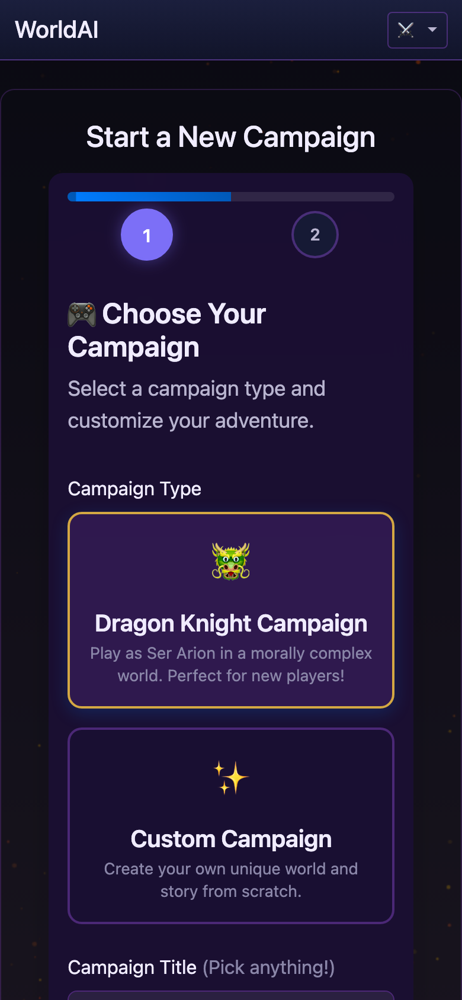
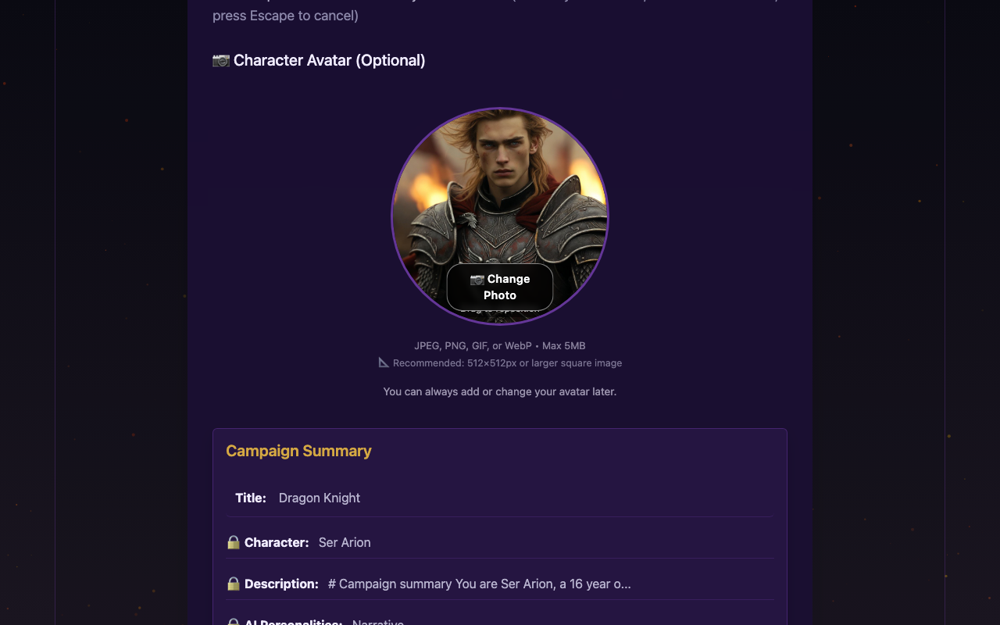

# How to Play WorldArchitect.AI

Your first 30 minutes with the game, step by step.

**The short version:** sign in with Google, click **Play a campaign**, pick the **Dragon Knight Campaign** card, click Next, click **Enter the World**, accept the character the GM offers, and start typing what you do. Everything below is that path in detail.

All screenshots are real captures from a Dragon Knight playthrough. A few come from an earlier build, so a couple of button labels have since changed; the captions say so. See [Screenshot provenance](#screenshot-provenance) for dates and viewports.

## Before you start

You'll need a web browser and a Google account. That's it — playing is free, and you don't need an idea for a setting if you take Dragon Knight.

## Step 1 — Sign in

1. Go to [worldarchitect.ai](https://worldarchitect.ai).
2. Click **Continue with Google** — Google sign-in is the only option.

You'll land on your **My Campaigns** dashboard. Every session starts here: launch new campaigns, search your history, pick up where you left off.

## Step 2 — Open the Campaign Wizard

From the dashboard, click the 📜 **Play a campaign** button in the top-right. That opens the [CampaignWizard](../concepts/CampaignWizard.md): two screens, **Choose Type** then **Launch**.

## Step 3 — Pick a campaign

Screen one offers two cards:

- **Play a campaign** — the custom path. You describe your own world: the Universe field takes anything you type (Naruto, Baldur's Gate 3, your own setting) and offers eight one-click suggestions, none of which come with pre-written lore.
- **Dragon Knight Campaign** — the one ready-made module. Full lore, a pre-built hero (Ser Arion, level 1 Paladin), two companions, and a tuned opening scene.

> **A naming trap:** the dashboard button you just clicked and the first card here are both called **Play a campaign**. They are not the same thing — the button opens the wizard, the card chooses the custom path.

**Recommendation for first-timers**: click the 🐲 **Dragon Knight Campaign** card. It is the second of the two, and the custom card is selected by default, so you do have to click Dragon Knight to switch. Picking it fills in and locks the setting and character for you.

**Same screen on mobile** (390×844, iPhone):

Click **Next** and the wizard moves to screen two, **Ready to Launch!** Check the summary, then click **Enter the World** — it sits right under the heading, and again at the bottom next to **Previous**.

Going custom instead? Write 1-3 sentences in the **Setting / world for your adventure** field, or open the **Campaign description prompt** (the last field, behind an **Expand** button) and paste a whole world bible — length is almost never your constraint. See [CampaignDesign](../concepts/CampaignDesign.md).

## Step 4 — Create your character

On Dragon Knight your character is already built: **Ser Arion**, Lvl 1 Paladin, STR 16 / CON 14 / CHA 16, 12 HP. The GM shows you the sheet and offers three choices:

1. **Finish Character Creation and Start Game** — accept the build and begin the mission.
2. **Edit Character** — change stats, skills, or equipment before you start.
3. **Custom Class** — design a unique class for Arion instead of the standard Paladin.

As on every turn, you can also ignore all three and type your own action instead.

On a custom campaign with no character, the GM instead offers three ways to build one: **AI Generated**, **Standard D&D** (step-by-step), or **Custom Class**.

**Recommendation for first-timers**: accept the pre-filled character. The campaign is tuned for it — click **Finish Character Creation and Start Game**.

## Step 5 — Read the opening scene

The GM narrates the opening. For Dragon Knight that's **The King's Ribbon, Winter-Mourn Province** — a road on horseback through a frozen province.

It establishes:
- **Where you are** — The King's Ribbon, Winter-Mourn Province, 95 AG, Frost-Fall 12, 09:00.
- **Who's with you** — **Ser Elian Thorne** (the idealist) and **Ser Vespera Nyx** (the pragmatist), two Imperial knights. You don't choose them; they're written into the scene. The moral contrast between them drives the whole opening, so talk to both.
- **What's happening** — You ride toward Winter-Mourn Keep, where Lady Annalise Ashwood (the province's March Lord, branded a traitor) shelters refugees against the Empress's pacification order.
- **What you can do** — Scout, address your companions, ride straight to the gate, or type a custom action.

**Take your time. Re-read it.** The first choice sets the tone of the entire campaign.

**Same scene on mobile** (the choices stack vertically):

## Step 6 — Take your first action

Click one of the offered choices, or type your own in the message box at the bottom. Examples:

- "I look around the room."
- "I draw my sword."
- "I introduce myself to the person across the table."
- "I cast Detect Magic."

The GM narrates the result and rolls any dice the action calls for. Read the narration and the dice results together.

### Check a choice before you commit

Each offered choice has a small chevron next to it. It shows you what the action actually involves — the check it will call for, and its upsides and downsides — before you spend a turn on it.

What the chevron does depends on your screen:

- **On a desktop or wide window**, the row expands in place: the description and the pros/cons sit under the choice. Clicking the choice itself sends it straight away — there's no second confirmation.
- **On a phone (a narrow window, roughly 640px or less)**, a panel slides up from the bottom of the screen instead. It's headed with the choice's name, then **Action Description & Check**, then a **Tactical Analysis** pair of cards — green for Pros, red for Cons. Nothing has been sent yet. To go through with it, tap **⚡ Confirm & Execute Action** at the bottom. To back out, tap the ✕, the grab bar at the top, the dimmed area behind the panel, or press Escape — your turn is untouched either way. On a phone you don't have to hit the chevron exactly; tapping anywhere on the row that isn't the choice itself opens the same panel.

On a small phone the list of choices also starts **collapsed**, so the narration and the message box stay in view. In its place you get a one-line strip — *"✨ 4 options — expand to see what you can do"* — with the number of choices this turn. Tap it to open the list, tap again to fold it away. Tapping into the message box folds it too, so the keyboard doesn't bury the text you're typing. The strip is a **Character** mode thing: switch to Think/Plan or God and the choices and the strip both disappear, since those modes aren't taking actions. See [ThinkMode](../concepts/ThinkMode.md) and [SmartSkillChecks](../concepts/SmartSkillChecks.md).

### The three buttons under the message box

They decide how your words are read, and you'll use all three:

| Button | What your text means | Does time pass? |
|---|---|---|
| **Character** (default) | What your character does and says | Yes — the story advances |
| **Think/Plan** | You talking strategy with the GM | No |
| **God** | You editing the campaign as its administrator | No |

Leave it on **Character** for now. **God** is where you fix a wrong stat or change how the GM writes — see [GodModePrompting](../concepts/GodModePrompting.md).

## Step 7 — Keep going

Play continues turn by turn:
1. GM narrates the current scene.
2. You declare an action (or pick a choice button).
3. System rolls dice if needed (server-side, anti-fabrication — see [DiceAuthenticity](../concepts/DiceAuthenticity.md)).
4. GM narrates the outcome.
5. Repeat.

In Dragon Knight the dragons (Aurum, Umbrax) are most active **early** — they act as a safety net for the first 100 turns, and if you never meet them they come looking for you somewhere around turns 51-75. Most first sessions reach turn 30-50.

## What can go wrong (and how to fix it)

### "The narration doesn't match my character"
Switch to the **God** button and write a standing rule, e.g. `GOD MODE: the narration has a stoic, minimalist tone`. The GM follows it from then on. See [GodModePrompting](../concepts/GodModePrompting.md).

### "The GM got something wrong, and I want it undone"
The campaign header has an **Undo** button (the ↺ icon) that deletes the most recent exchange — it asks you to confirm first, and it cannot be un-done. It only removes the *last* turn. For anything older, God Mode is the fix: it can correct a stat, remove an item you never had, or replace the text of a scene that went wrong. `GOD MODE: set my HP to 12` or `GOD MODE: I never picked up the ring`. See [GodMode](../concepts/GodMode.md).

### "I died"
In Dragon Knight, during the first 100 turns: at 25% HP or below a dragon whispers an offer of rescue (you can accept, refuse, or ignore it), and at 0 HP one intervenes anyway and you wake up alive somewhere else. Which dragon shows up depends on how ruthlessly you have been playing. Past turn 100 that net is gone. In other campaigns, what happens after death is up to the GM and your setting.

### "The campaign is too slow / too fast"
Slow: ask the GM to skip ahead ("I time-skip a week").
Fast: ask for more detail ("Describe what the room looks like").

### "I'm stuck on what to do"
Ask the GM directly: "What should I do next?" or "What are my options?" You'll usually get 2-3 suggestions back.

### "The dice hate me"
That's the game. High variance is part of D&D. Plan around it: have backup options, build for advantage, bring healing.

### "It says I've hit my turn limit"
Playing is free, but each account gets 100 turns a day and 50 in any 5-hour window. Wait for the window to roll over, or use the **Add your key — higher limits** button in the campaign header to supply your own model API key, which raises both caps — 5,000 turns a day and 1,000 in any 5-hour window.

## After your first session

Your campaign saves itself — just close the tab and click its card next time. (You can also export it: [PlayerUserStories](PlayerUserStories.md#us-072-download--share-campaign-story).)

Then, in this order:

1. [GodModePrompting](../concepts/GodModePrompting.md) — shape how the GM writes. This is the one that changes your second session the most.
2. [CampaignDesign](../concepts/CampaignDesign.md) — when you're ready to build your own world instead of playing Dragon Knight.
3. [CampaignShowcase](../entities/CampaignShowcase.md) — what other players built.
4. [PlayerUserStories](PlayerUserStories.md) — the full list of what the game can do.

## Screenshot provenance

All screenshots on this page were captured **2026-06-20** from a real playthrough of the Dragon Knight campaign, at these window sizes:

- Desktop: 1280×800
- Mobile: 390×844 (iPhone 12/13/14 size)

The session is real. Every line of narration in the pictures was written by the AI Game Master during play — nothing is mocked up, and the "Checking the rulebook..." overlay in the last screenshot is the genuine waiting state while the GM thinks.
