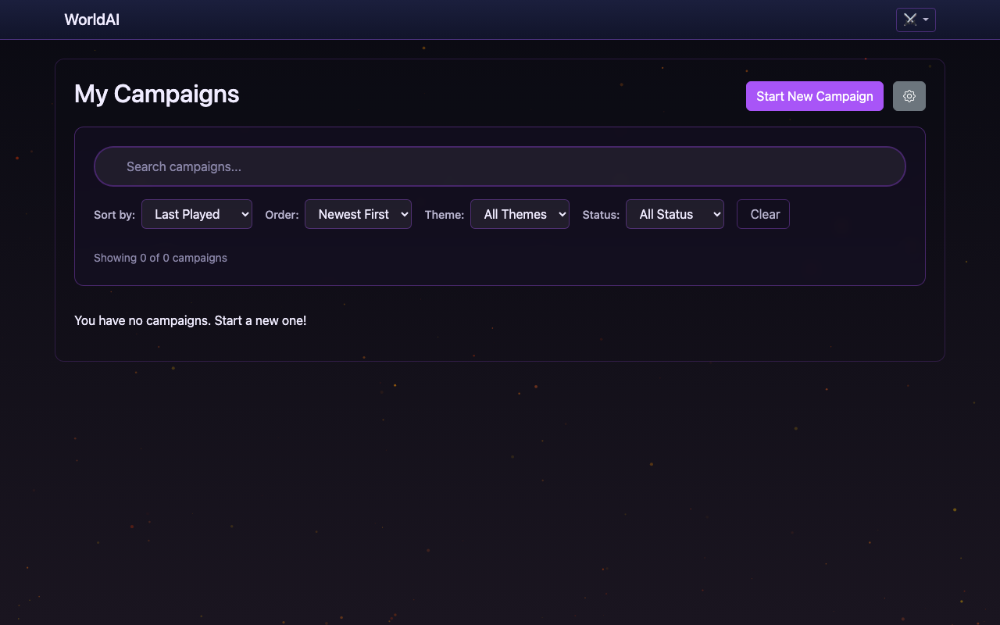
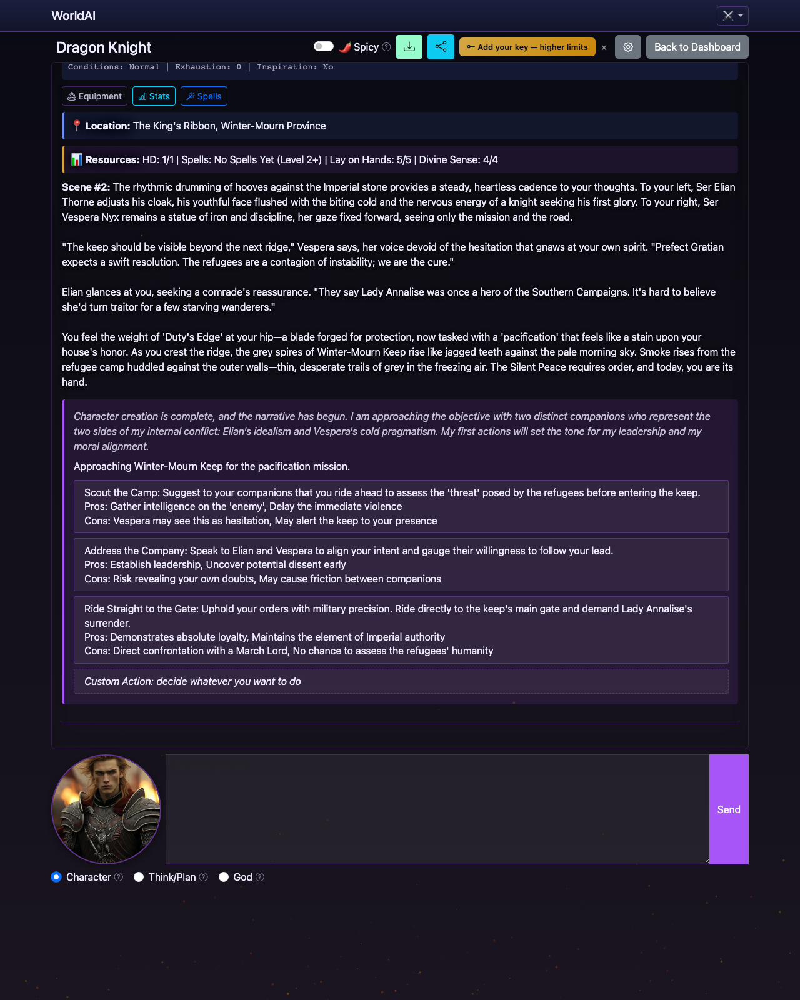
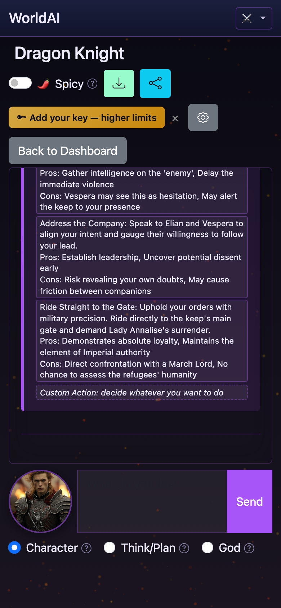
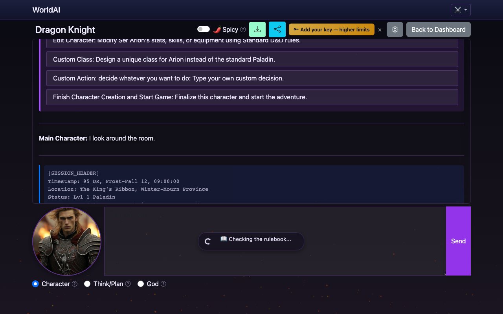

# How to Play WorldArchitect.AI

Your first 30 minutes with the game, step by step.

All screenshots below are **real captures** taken from a live
[worldarchitect.ai](https://worldarchitect.ai) instance running the
canonical **Dragon Knight** built-in campaign. Desktop shots are
1280×800; mobile shots are 390×844 (iPhone 12/13/14/15 standard).

> **Note on wizard screenshots.** Captures dated 2026-06-20 under
> `queries/images/how-to-play-worldai/step2-*` and `step3-*` and
> `step4-*` describe an older 3-step wizard (Setting → Character →
> Companion). They are stale and have been removed from the frontmatter
> screenshot list. See **What the wizard looks like today** below for
> fresh captures of the current 2-step Choose Type → Launch flow.

## Before you start

You'll need:
- A web browser
- An account at [worldarchitect.ai](https://worldarchitect.ai)
- An idea for a setting (or willingness to use the built-in Dragon
  Knight preset)

## Step 1 — Sign up

1. Go to [worldarchitect.ai](https://worldarchitect.ai).
2. Click "Sign in" (Google or Apple SSO).
3. Confirm your account.

After sign-in you'll land on your **My Campaigns** dashboard. From
here, every session begins — this is the home base where you launch
new campaigns, search your history, and pick up where you left off.



## Step 2 — Open the Campaign Wizard

From the dashboard, click "Start New Campaign". You'll see the
[CampaignWizard](../concepts/CampaignWizard.md) — two steps. Step 1
is **Choose Type**. Step 2 is **Ready to Launch**.

The wizard shows a progress bar with two circles ("1 Choose Type" /
"2 Launch") and a "Step 1 of 2" counter at the bottom. The
**Dragon Knight Campaign** card is pre-selected by default with the
title `Dragon Knight` already filled in.

For the visual layout of the current wizard, see **What the wizard
looks like today** below.

**Recommendation for first-timers**: keep the Dragon Knight card
selected. It's pre-selected by default. The system has full lore, a
pre-built character, and the opening scene is well-tuned.

If you want a custom world instead, click the **Custom Campaign** card,
edit the title to anything you like (the placeholder is `My Epic
Adventure`), and leave the Character and Setting fields blank to let
the system generate them, or type 1–3 sentences describing your
character / world. See [CampaignDesign](../concepts/CampaignDesign.md)
Step 1 for what makes a setting "hold up."

## Step 3 — Review the Campaign Summary and launch

Click **Next** to advance to step 2. You'll see:

- A big green **Enter the World** button at the top — click it when
  you're ready.
- An optional **Character Avatar** upload (square image, ≤ 5 MB).
- A **Campaign Summary** card with editable rows for Title, Character,
  and Description. Click any row's pencil icon to edit; click outside
  the input to save, or press **Escape** to cancel.

The campaign is created the moment you click **Enter the World** and
you're routed into the opening scene.

## Step 4 — Read the opening scene

The GM will narrate the opening. For Dragon Knight, that's **Scene #2:
The King's Ribbon, Winter-Mourn Province** — a road on horseback through
a frozen province, with the cold hard cadence of imperial stone under
hoofbeats.

It establishes:
- **Where you are** — The King's Ribbon, Winter-Mourn Province, 95 AG,
  Frost-Fall 12, 09:00.
- **What's happening** — You and two knight-companions ride toward
  Winter-Mourn Keep, where Lady Annalise Ashwood (a former hero now
  branded a traitor) shelters refugees against the Empress's
  pacification order.
- **What you can do** — Scout, address your companions, ride straight
  to the gate, or type a custom action.

**Take your time. Re-read it.** The first choice sets the tone of the
entire campaign.



**Same scene on mobile** (the choices stack vertically):



## Step 5 — Take your first action

Type your first action in the input box at the bottom. Examples:

- "I look around the room."
- "I draw my sword."
- "I introduce myself to the person across the table."
- "I cast Detect Magic."

The GM will narrate the result. The system may auto-roll dice. Read the
narration and the dice results together.

For Dragon Knight, the **first recommended action** is one of the three
offered choices — or **type a custom action** to take the narrative in
an unexpected direction.



## Step 6 — Iterate

Play continues turn by turn:
1. GM narrates the current scene.
2. You declare an action (or pick a choice button).
3. System rolls dice if needed (server-side, anti-fabrication — see
   [DiceAuthenticity](../concepts/DiceAuthenticity.md)).
4. GM narrates the outcome.
5. Repeat.

The Dragon Knight campaign runs ~100 turns before the dragons (Aurum,
Umbrax) start directly intervening. Most first sessions reach turn
30-50.

## What the wizard looks like today

Fresh captures of the current 2-step wizard live at this operator path
(not committed to the public wiki repo — only the markdown is):

```text
~/evidence-wiki-wizard-refresh-2026-08-31/
├── step1-choose-type-desktop.png
├── step1-choose-type-custom-desktop.png
├── step2-ready-to-launch-desktop.png
├── step1-choose-type-mobile.png
├── step1-choose-type-custom-mobile.png
└── step2-ready-to-launch-mobile.png
```

Captures were taken **2026-08-31** from a local development server
running the latest `main` branch of
[jleechanorg/worldarchitect.ai](https://github.com/jleechanorg/worldarchitect.ai),
authenticated via the development test-mode flow that bypasses real
Google/Apple auth. The campaign ID for the Dragon Knight session shown
is the canonical built-in preset (`Dragon Knight`).

### Step 1 — Choose Type (default, Dragon Knight pre-selected)


The progress bar shows half-fill with circle 1 lit ("1 Choose Type"),
circle 2 dim ("2 Launch"). The Dragon Knight Campaign card has the
yellow selection border. The Campaign Title field is pre-filled with
`Dragon Knight`. A collapsible "Expand" toggle reveals the optional
long-form Campaign description prompt below.

### Step 1 — Custom Campaign selected


The Custom Campaign card now has the selection border. The Campaign
Title resets to the placeholder `My Epic Adventure`. The Character
field shows the placeholder `Random character (auto-generate)` and
Setting shows `Random fantasy D&D world (auto-generate)`. The Dragon
Knight description block is hidden and the Custom-only Campaign
description prompt is shown.

### Step 2 — Ready to Launch


The progress bar is full, circle 1 has the green "done" fill, circle 2
is lit ("2 Launch"), and the counter reads "Step 2 of 2". The big
green **Enter the World** button is at the top, then the optional
Character Avatar upload zone, then the Campaign Summary card listing
the Title / Character / Description that will be used at launch (each
row has a pencil edit icon).

## What can go wrong (and how to fix it)

### "The narration doesn't match my character"
Add a god mode directive to refine. See
[GodModePrompting](../concepts/GodModePrompting.md).

### "I died"
Most campaigns have resurrection. Dragon Knight has the **Dragon
Rescue** rule — if your character drops below 25% HP in the first 100
turns, a dragon intervenes to save them. If not, the campaign ends —
start a new one with the lessons learned.

### "The campaign is too slow / too fast"
Slow: ask the GM to skip ahead ("I time-skip a week").
Fast: ask for more detail ("Describe what the room looks like").

### "I'm stuck on what to do"
Ask the GM directly: "What should I do next?" or "What are my
options?" Most agents will suggest 2-3 options.

### "The dice hate me"
That's the game. High variance is part of D&D. Plan around it: have
backup options, build for advantage, bring healing.

## After your first session

- **Review**: what worked? what didn't?
- **Save**: campaign state is auto-saved, but you can also export
  ([PlayerUserStories](PlayerUserStories.md#US-072|download)).
- **Iterate**: apply lessons to your next campaign.

## Next steps

- Read [GodModePrompting](../concepts/GodModePrompting.md) to learn how
  to shape narration.
- Read [CampaignDesign](../concepts/CampaignDesign.md) to plan your next
  campaign.
- Read [CampaignShowcase](../entities/CampaignShowcase.md) for
  inspiration.
- Read [PlayerUserStories](PlayerUserStories.md) for the full list of
  what the game can do.

## Sources

- [worldarchitect.ai README](https://github.com/jleechanorg/worldarchitect.ai/blob/main/README.md)
  — quick-start.
- [worldarchitect.ai user stories](https://github.com/jleechanorg/worldarchitect.ai/blob/main/docs/user-stories-general.md)
  — full system coverage.
- [Dragon Knight world module](https://github.com/jleechanorg/worldarchitect.ai/blob/main/world_reference/campaign_module_dragon_knight.md)
  — the canonical built-in campaign used in the screenshots above.

## Screenshot provenance

The current (non-wizard) screenshots in this page were captured
**2026-06-20** from a live local development server running the latest
`main` branch of
[jleechanorg/worldarchitect.ai](https://github.com/jleechanorg/worldarchitect.ai),
signed in via the development test-mode flow that bypasses real
Google/Apple auth.

The campaign ID for the Dragon Knight session shown is
**`sXVHWBu34TP0qhPWLeBY`**.

Captures were taken with **Playwright headless Chromium** at the
following viewports:
- Desktop: 1280×800
- Mobile: 390×844 (iPhone 12/13/14 standard)

The wizard screenshots in the **What the wizard looks like today**
section above were captured **2026-08-31** from the same local
test-server flow; the PNG files themselves live outside this public
repo at the operator path shown in that section.

The sessions are real — the GM narration in the screenshots is
generated by the live LLM, not a static fixture. The
"Checking the rulebook..." overlay visible in
`step7-first-action-desktop.png` is the production loading state during
a real LLM call.